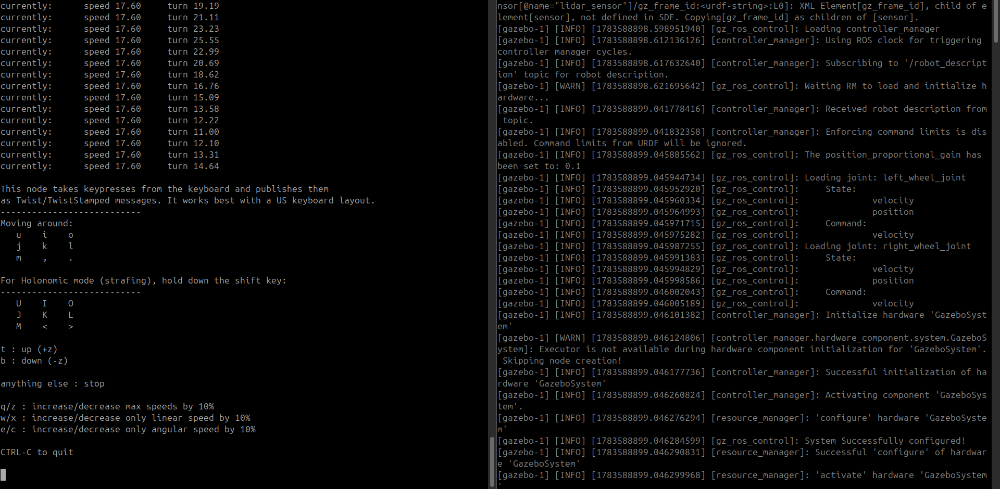

<div align="center">
  
# 🤖 Two Wheel Robot

**A comprehensive ROS 2 Jazzy Differential Drive Simulation**

[](https://docs.ros.org/en/jazzy/)
[](https://gazebosim.org/)
[](https://www.python.org/)
[](https://ubuntu.com/)

</div>

<br>

A robust and highly-customizable **differential drive robot simulation** developed for ROS 2 Jazzy and Gazebo Harmonic. This project serves as a comprehensive foundation for autonomous mobile robotics, demonstrating best practices in robot modeling (URDF/Xacro), physics simulation, and control.

---

## 🎥 Simulation Demo

[](https://github.com/Amin-Ahmed-G/two_wheel_robot/blob/main/two_wheel_robot.mp4)

*Click the image above to watch the simulation video.*

---

## ✨ Key Features

- **Differential Drive Kinematics**: Accurate physics and movement.
- **Modern Stack**: Built natively on **ROS 2 Jazzy** & **Gazebo Harmonic**.
- **Sensor Ready**: Configured for seamless integration with LiDAR and Camera.
- **RViz2 Dashboard**: Includes complete RViz visualization overlays and dashboards.
- **Parametric Modeling**: Highly modular URDF/Xacro robot model.
- **Controller Manager**: Pre-configured `ros2_control` parameters.

---

## 🛠️ Prerequisites & Installation

### Requirements
- **OS:** Ubuntu 24.04
- **ROS Version:** ROS 2 Jazzy
- **Simulator:** Gazebo Harmonic
- **Dependencies:** `colcon`, Python 3

### Quick Start
Clone the repository into your workspace and build the package:

```bash
cd ~/ros2_ws/src
git clone https://github.com/Amin-Ahmed-G/two_wheel_robot.git
cd ~/ros2_ws
colcon build --packages-select two_wheel_robot
source install/setup.bash
```

---

## 🚀 Usage

Launch the complete Gazebo simulation and RViz visualization:

```bash
ros2 launch two_wheel_robot two_wheel_gazebo_launch.py
```

---

## 📸 Media Gallery

<div align="center">
  
  
</div>

---

## 📂 Project Structure

```text
two_wheel_robot/
├── config/           # Controller and RViz configurations
│   └── two_wheel_controllers.yaml
├── launch/           # Launch files for simulation and nodes
│   └── two_wheel_gazebo_launch.py
├── src/              # Python node source files
│   └── waypoint_follower_node.py
├── urdf/             # Xacro and URDF model descriptions
│   └── 2_wheel.xacro
└── worlds/           # Gazebo simulation environments
    └── two_wheel_world.sdf
```

---

## 🗺️ Roadmap & Future Improvements

- [x] Robot URDF/Xacro Modeling
- [x] Gazebo Simulation Environment
- [x] ROS 2 Controller Integration
- [ ] 📡 LiDAR Integration & Obstacle Avoidance
- [ ] 📷 Camera Integration & Object Detection
- [ ] 🗺️ SLAM Toolbox Mapping
- [ ] 🧭 Nav2 Navigation Stack Integration
- [ ] 🤖 Autonomous Waypoint Navigation & Exploration

---

## 👨‍💻 Author

**Amin Ahmed G**  
*Robotics & Automation Engineer*

[](https://github.com/Amin-Ahmed-G)
[](https://linkedin.com/in/your-linkedin-profile)

---

<div align="center">
  <b>⭐ If you find this project helpful, please consider giving it a star! ⭐</b>
</div>
